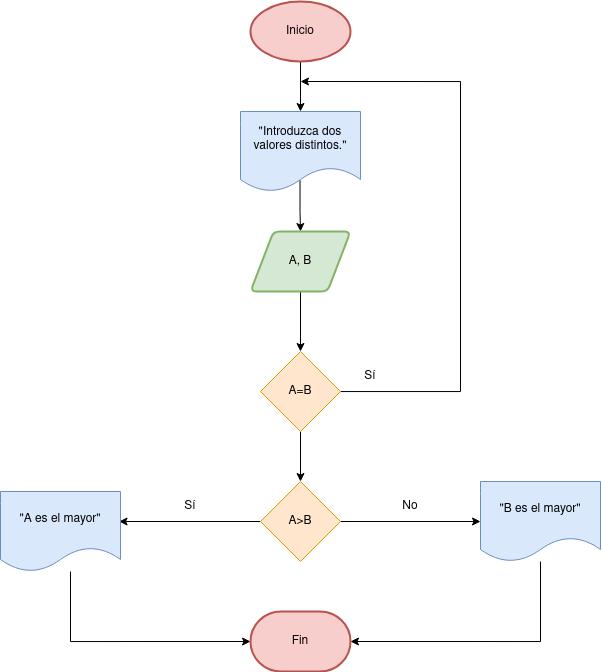
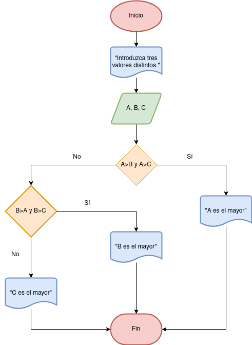

# Ejercicios

-[Ejercicio 1](#ejercicio1)
-[Ejercicio 2](#ejercicio2)

## Ejercicio 1 -[Ejercicio 2](#ejercicio2)

Desarrolle un algoritmo que permita leer dos valores distintos, determinar cual de los dos valores es el
mayor y escribirlo.

### Diagrama de flujo

### Pseudocodigo

Pasos:
- Inicio

- Inicializar variables: __A = 0, B = 0__

- Solicitar la introducción de dos valores distintos

- Leer los dos valores

- Asignarlos a las variables A y B

- Si __A = B__ Entonces vuelve a 3 porque los valores deben ser
  distintos

- Si __A>B__ Entonces
  Escribir __A, “Es el mayor”__

- De lo contrario: Escribir __B, “Es el mayor”__

- Fin_Si

- Fin

## Ejercicio 2

### Pseudocodigo

Pasos:
- Inicio
-  Inicializar las variables A, B y C
- Leer los tres valores
- Almacenar en las variables A, B y C
- Si A > B y A > C Entonces
- Escribir A “Es el mayor”
- Sino
- Si B > A y B > C Entonces
- Escribir B “Es el mayor”
- Sino
- Escribir C “Es el mayor”
- Fin_Si
- Fin_Si
- Fin

### Diagrama de flujo

