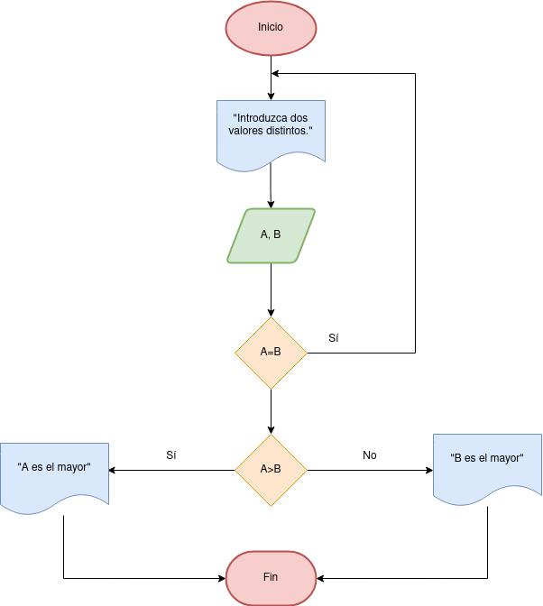

# Ejercicios

-[Ejercicio 1](#ejercicio1)

## Ejercicio 1 

Desarrolle un algoritmo que permita leer dos valores distintos, determinar cual de los dos valores es el
mayor y escribirlo.

### Diagrama de flujo

