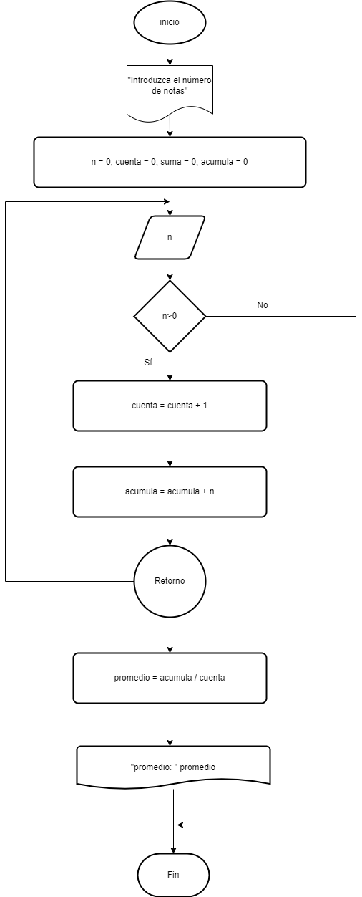

## Ejercicio 8 

### Diagrama de flujo

### Pseudocodigo

1. Inicio
2. Declaración de variables 
- - n=0, promedio=0, acumula=0, cuenta=0
3. Leer n
4. While n>0
5.      cuenta = cuenta + 1
6.      acumula = acumula + n
7. Fin while
8.      promedio = acumula/cuenta
9. Mostrar "Promedio"+promedio
10. Fin

