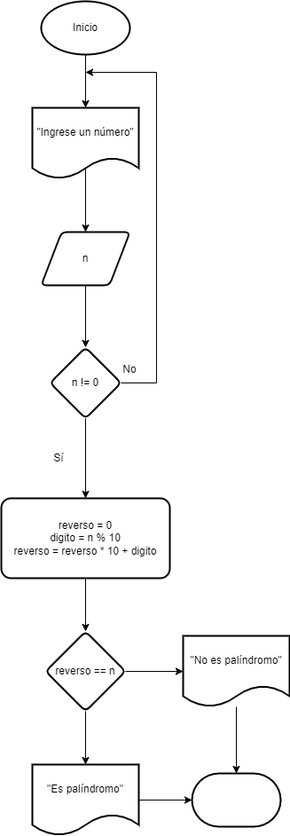
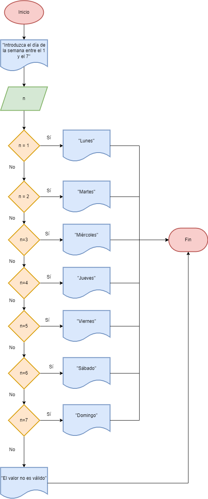

# Tarea 3

-[ Ejercicio1](#ejercicio-1)
-[ Ejercicio4](#ejercicio-4)
-[ Ejercicio7](#ejercicio-7)
-[ Ejercicio8](#ejercicio-8)

## Ejercicio 1 

### Seudocódigo
1. Inicio.
2. Empezar contador desde el 1 hasta el 10.
        for (int n = 1; n <= 10, n++>)
3. Hacer contador de filas.
4. Hacer contador de números por fila.
5. Imprimir cada fila. 

## Ejercicio 4 
Escribe un programa en Java que verifique si un número es palíndromo. Se debe solicitar el número por teclado.

### Seudocódigo

1. Inicio.
2. Pedimos variable n y que lo lea.
3. Creamos funcion espalindromo.
4. Mientras n sea distinto de 0.
5.  Almacenar último digito.
6.  Construimos el número en reverso multiplicando por 10 y sumandole el dígito.
7.  Dividimos n entre 10 para eliminar el último dígito.
8. Si reverso == n.
9. entonces imprimir "Es palíndromo".
10. Sino, imprimir "No es palíndromo".

### Diagrama de flujo

fin

## Ejercicio 7

7. Imprimir el nombre del día de la semana correspondiente a un número ingresado por el usuario utilizando una estructura switch.
 El día a verificar se debe de pedir por teclado.

### Seudocódigo

1. Inicio.
2. Solicitar día de la semana del 1 al 7.
        int n = lectura.nextInt();
3. Condición con switch.
4. Caso si n=1, imprimir "Lunes".
5. Caso si n=2, imprimir "Martes".
6. Caso si n=3, imprimir "Miércoles".
7. Caso si n=4, imprimir "Jueves".
8. Caso si n=5, imprimir "Viernes".
9. Caso si n=6, imprimir "Sábado".
10. Caso si n=7, imprimir "Domingo".
11. Si n es diferente a estos valores

### Diagrama de flujo

## Ejercicio 8 

8. Encontrar y mostrar todos los números perfectos en un rango dado utilizando un bucle for.  
Solicita el límite por teclado.

### Seudocódigo

1. Inicio.
2. Solicitar al usuario el rango máximo para calcular los números perfectos.
3. Crear variables sumadedivisores, rango.
4. Para n=1, hasta que sea igual a rango, ir sumando 1.
        for (int n = 1; n<= rango; n++)
5. Calcular los divisores del número.
6. Para divisor = 1, mientras sea menor que rango, ir sumando 1.
        for(int divisor = 1; divisor <= n/2; divisor++)
7. Ir sumando los divisores
8. Si sumadedivisores == n, almacenar e imprimir. 

### Diagrama de flujo

