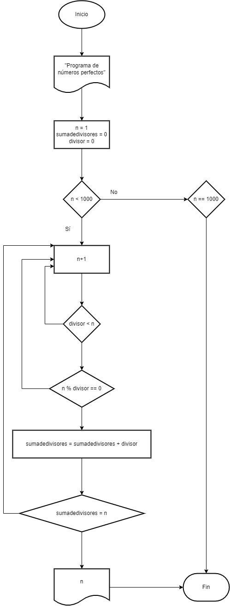

# Tarea2: Números perfectos.

## Seudocódigo
    1. Inicio
    2. Imprimir descripción del programa.
    3. Bucle for, declaración del rango 1 a 1000 y variables
    4.      mientras n < 1000, hasta 1000, sumar 1 
    5.      n = 1
    6.      sumadedivisores = 0
    7. Bucle for para divisor y comprobar si es divisor
    8.      mientras divisor < n, sumar 1
    9.      Si n % divisor == 0
    10.     sumadivisores = sumadivisores + divisor
    11. Comprobar si sumadivisores == n
    12. Imprimir

## Diagrama de flujo

