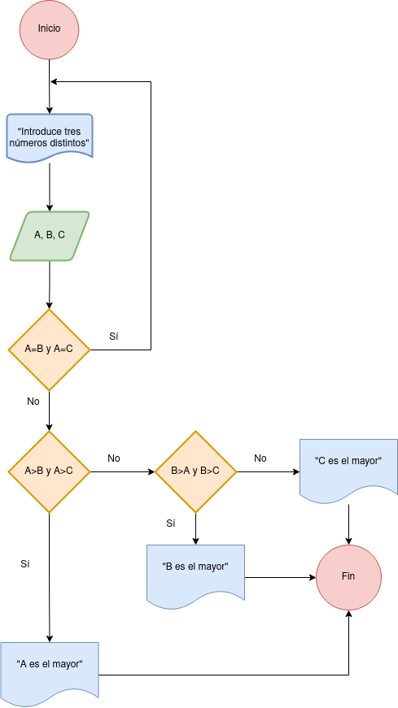

# Ejercicio 2

<!-- Recuerda que

## 1. Subtítulo tarea

### 1.1 Subtítulo de la tarea

-- Incluir imagenes

     

-->

## Descripción del ejercicio

Desarrolle un algoritmo que permita leer tres valores y almacenarlos en las variables A, B y C respectivamente. El algoritmo debe imprimir cual es el mayor y cual es el menor. Recuerde constatar que los tres valores introducidos por el teclado sean valores distintos. Presente un mensaje de alerta en caso de que se detecte la introducción de valores iguales.

## Diagrama de flujos

## Pseudocódigo

Inicio
1. Pedir variables A, B y C al usuario
2. Entrada de variables A, B y C
3. Leer los tres valores
4. Almacenar en las variables A, B y C
5. Si A = B = C
6. Entonces
7. Pedir variables A, B, C al usuario
8. Sino
9. Si A > B y A > C 
10. Entonces
11. Escribir A “Es el mayor”
12. Sino
13. Si B > A y B > C Entonces
14. Escribir B “Es el mayor”
15. Sino
16. Escribir C “Es el mayor”
17. Fin_Si
18. Fin_Si

 Fin

## Referencias

